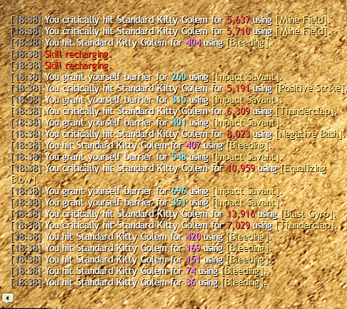
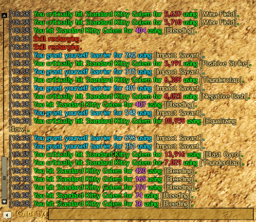

# Colorful Chat

A [Nexus](https://github.com/RaidcoreGG/NEXUS) addon for [Guild Wars 2](https://www.guildwars2.com/) that allows you to customize the colors of the game chat.

| Default                                    | Custom colors + High contrast                |
| ------------------------------------------ | -------------------------------------------- |
|  |  |

> 👀 Click the images to view them at higher quality. Image downscaling may reduce text clarity.

## Features

### Chat Customization

- Customize colors for each chat channel and message individually
- Custom colors for all six guild chats
- Dim chats from inactive guilds
- Show the active guild chat in the `Guild Active` color instead of its custom color
- Separate colors for `CombatInHeal` and `CombatOutHeal` messages

### Accessibility

- High-contrast text
- XL text size that is ~20% larger than the original chat’s maximum text size

### Misc

- Increased chat history limit from 200 to 1000 messages (**EXPERIMENTAL**)
- Keep chat history visible with hidden chat background

## Installation

> [!NOTE]
> You can install the addon directly through the in-game Nexus library with a single click.

If you prefer a manual install:

1. Download the latest [`colorful_chat.dll`](https://github.com/mriot/colorful-chat-releases/releases/latest/download/colorful_chat.dll)
2. Put the file into your Guild Wars 2 Nexus addons folder (e.g., `C:/Program Files/Guild Wars 2/addons`)  
3. Enable the addon in-game in Nexus

## Disclaimer

### USE AT YOUR OWN RISK

The addon is provided as-is. It’s meant to be helpful, but the author can’t take responsibility for problems that may occur.  
Using third-party addons in Guild Wars 2 is always at your own discretion.

## Source Code

The source code is kept private to comply with ArenaNet’s guidelines for addons that interact with the game’s memory.

## Dependencies

- [Nexus](https://raidcore.gg/Nexus)
- [ImGui](https://github.com/ocornut/imgui)
- [inifile-cpp](https://github.com/Rookfighter/inifile-cpp)

Special thanks to Delta, Vonsh, and Gera for their support, along with several others from the [Raidcore discord](https://discord.gg/raidcore) who contributed with testing and feedback.

---

This addon is not affiliated with nor endorsed by ArenaNet or NCSOFT.
