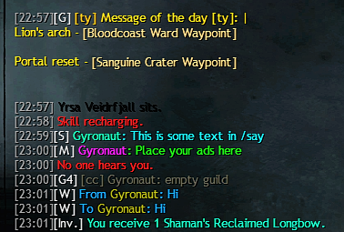

# Colorful Chat

A [Nexus](https://github.com/RaidcoreGG/NEXUS) addon for [Guild Wars 2](https://www.guildwars2.com/) that allows your to customize the colors of the game chat.

👀 Big Settings UI sreenshot

    

## Installation

> [!NOTE]
> You can install the addon directly through the in-game Nexus library with a single click.

If you prefer a manual install:

1. Download the latest [`colorful_chat.dll`](https://github.com/mriot/colorful-chat-releases/releases/latest/download/colorful_chat.dll)
2. Put the file into your Guild Wars 2 Nexus addons folder (e.g., `C:/Program Files/Guild Wars 2/addons`)  
3. Enable the addon in-game in Nexus

## Disclaimer

### USE AT YOUR OWN RISK

The addon is provided as-is. It’s meant to be helpful, but the author can’t take responsibility for problems that may occur.  
Using third-party addons in Guild Wars 2 is always at your own discretion.

## Source Code

The source code is not public. This repository is only used for releases.  
Memory reading and related logic are kept private to stay in line with ArenaNet’s general guidelines for addon development.

## Dependencies

- [Nexus](https://raidcore.gg/Nexus)
- [ImGui](https://github.com/ocornut/imgui)
- [inifile-cpp](https://github.com/Rookfighter/inifile-cpp)

Special thanks to Delta, Vonsh and Gera for their support

---

This addon is not affiliated with nor endorsed by ArenaNet or NCSOFT.
