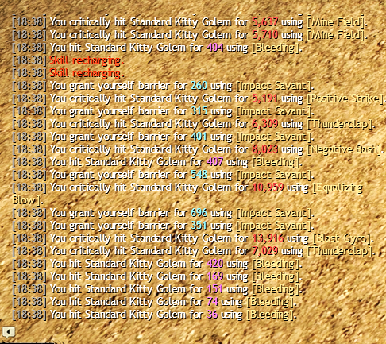
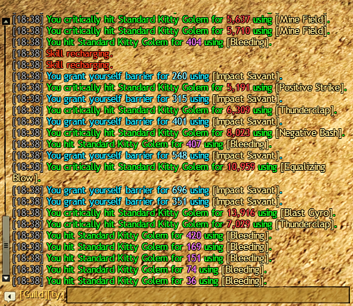

# Better Chat

A [Nexus](https://github.com/RaidcoreGG/NEXUS) addon for [Guild Wars 2](https://www.guildwars2.com/) that allows you to customize the in-game Chat.

| Default                                    | Custom colors + High contrast                |
| ------------------------------------------ | -------------------------------------------- |
|  |  |

> 👀 Click the images to view them at higher quality. Image downscaling may reduce text clarity.

## Features

### Chat Customization

- Customize colors for each chat channel and message individually
- Custom colors for all six guild chats
- Dim chats from inactive guilds
- Custom colors for combat log
- Adjust the chat window size without limitations

### Accessibility

- High-contrast text
- Alternative squad channel tag `[S]` -> `[Squad]` to make it more distinguishable from the say tag `[S]`
- Sound notifications for squad, party and guild messages with optional cooldown
- XL text size that is ~20% larger than the original chat’s maximum text size
- XXL text size that is ~50% larger than the original chat’s maximum text size

### Misc

- Increased chat history limit from 200 to 1000 messages
- Keep chat messages visible with hidden chat background
- In-world speech bubbles for guild chats
- Hidden initial `(press Enter to chat)` hint in the chat input box
- Suppressed guild `Message Of The Day` chat messages
- `/self` command to quickly send private messages to yourself

## Installation

> [!NOTE]
> You can install the addon directly through the in-game Nexus library with a single click.

If you prefer a manual install:

1. Download the latest [`better_chat.dll`](https://github.com/mriot/better-chat-releases/releases/latest/download/better_chat.dll)
2. Put the file into your Guild Wars 2 Nexus addons folder (e.g., `C:/Program Files/Guild Wars 2/addons`)  
3. Enable the addon in-game in Nexus
4. Click the configure button to configure the addon to your liking

## Source Code

The source code is kept private to comply with ArenaNet’s guidelines for addons that interact with the game’s memory.  
Code review may be requested by ArenaNet at any time, and individuals may review the non memory-interacting parts of the code upon request.

## Dependencies

- [Nexus](https://raidcore.gg/Nexus)
- [ImGui](https://github.com/ocornut/imgui)
- [inifile-cpp](https://github.com/Rookfighter/inifile-cpp)

Special thanks to Delta, Vonsh, and Gera for their support, along with several others from the [Raidcore discord](https://discord.gg/raidcore) and Bird who contributed with testing and feedback.

## Disclaimer

### ⚠️ USE AT YOUR OWN RISK ⚠️

The addon is provided as-is. It’s meant to be helpful, but I can’t take responsibility for problems that may occur.  
Using third-party addons in Guild Wars 2 is always at your own discretion.

---

This addon is not affiliated with nor endorsed by ArenaNet or NCSOFT.
